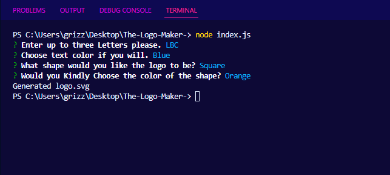

Richard Murillo's README

 # The Logo Maker

## Table of Contents

 * [Description](#description)

 * [Installation](#installation)

 * [Usage-Information](#usage-information)

 * [Contribution-Guidelines](#contribution-guidelines)

 * [Test-Instructions](#test-instructions)

 * [License](#license)

 * [Questions](#questions)

## Description

A simple logo maker. Using inquirer to prompt the user within the command line for how they would like their logo to lookusinf three letters three shapes (triangle, square and circle) also any color for the leters and shapes.

## Installation

Clone the repo: https://github.com/RichMur84/The-Logo-Maker-.git then in VSCode using the terminal install node.js inquirer and jest run in terminal node index.js.

## Usage Information

Gives the user the ability to generate logos quickly and easily through the use of SVG files, entirely from the command line. No UI (user interface) needed, and no front end tools needed.

## Contribution Guidelines

Any Questions feel free to contact me or submit a branch to github, and wait for approval. 

## Test Instructions
Link to video: https://drive.google.com/file/d/1iB8NpQaXaduDnyc4agMZxrWYEFmq04uj/view

Screenshots: 

 

## License

NOTICE: This application is covered under the MIT

## Questions

Have additional questions? Click the links below to reach me through my GitHub account or Email address.

[Link to Github](https://github.com/https://github.com/RichMur84)

<a href="mailto:grizzlylbc1@gmail.com">grizzlylbc1@gmail.com</a>

